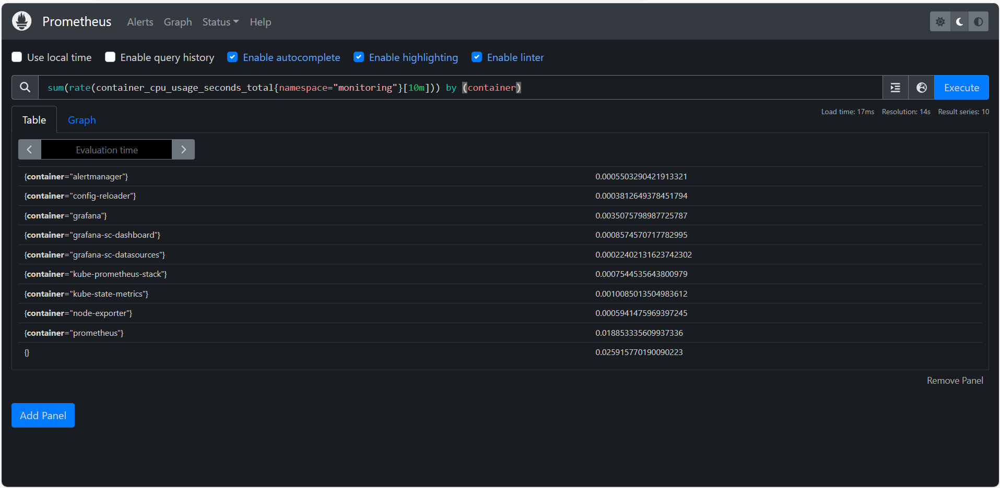
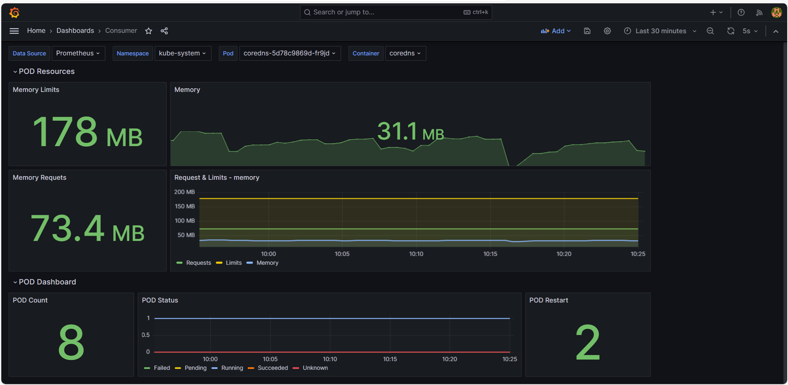

# Mentoria DevOps Cloud - módulo Monitoramento e Observabilidade

Laboratório da Mentoria de DevOps Cloud utilizando Prometheus e Grafana instalados em um Cluster Kubernetes.

- **Prometheus**: ferramenta de monitoramento para coleta de métricas de um ambiente
- **Grafana**: ferramenta de observabilidade para visualização de dados por meio de dashboards

## Instalação do Kubectl
```
curl -LO "https://dl.k8s.io/release/$(curl -Ls https://dl.k8s.io/release/stable.txt)/bin/linux/amd64/kubectl"
chmod +x kubectl
sudo mv kubectl /usr/local/bin/
```

## Instalação do Kind
```
[ $(uname -m) = x86_64 ] && curl -Lo ./kind https://kind.sigs.k8s.io/dl/v0.20.0/kind-linux-amd64
chmod +x kind
sudo mv kind /usr/local/bin
```

## Criação do cluster K8s com Kind
```
kind create cluster --name kind-mdc --config kind.yaml
kubectl cluster-info --context kind-kind-mdc
```

## Configuração do Ingress Nginx no cluster usando um Helm-chart
```
kubectl create ns ingress-nginx
```
```
helm upgrade -i ingress-nginx ingress-nginx/ingress-nginx \
--namespace ingress-nginx \
--set controller.metrics.enable=true \
--set controller.podAnnotations."prometheus\.io/scrape"=true \
--set controller.podAnnotations."prometheus\.io/port"=10254
```
```
kubectl apply -f https://raw.githubusercontent.com/kubernetes/ingress-nginx/master/deploy/static/provider/kind/deploy.yaml
```
```
helm list -A
kubectl --namespace ingress-nginx get services
```

## Instalação da stack Prometheus e Grafana utilizando um Helm-chart do Prometheus Community
```
kubectl create namespace monitoring
helm repo add prometheus-community https://prometheus-community.github.io/helm-charts
helm install mdc-prometheus prometheus-community/kube-prometheus-stack --namespace monitoring
```
```
helm list -A
kubectl --namespace monitoring get all
```

## Deploy de uma aplicação de teste no Cluster
```
kubectl apply -f app-mdc/
kubectl get all -n app-mdc
```

## Port Foward para acessar o Prometheus na porta 9090
```
kubectl get pods -n monitoring
kubectl port-forward pod/prometheus-mdc-prometheus-kube-promet-prometheus-0 9090:9090 -n monitoring
```



## Port Foward para acessar o Grafana na porta 3000
```
kubectl get all -n monitoring | grep "grafana"
kubectl port-forward deployment.apps/mdc-prometheus-grafana 3000:3000 -n monitoring
```
Para acessar o Grafana, utilizar o logon padrão:
- usuario: `admin`
- senha: `prom-operator`



## Prometheus promQL: algumas queries de exemplo
exemplo 1:
```
sum(kube_namespace_status_phase{job="kube-state-metrics"}) by (namespace)
```

exemplo 2:
```
sum(rate(container_cpu_usage_seconds_total{namespace="monitoring"}[10m])) by (container)
```

exemplo 3:
```
sum(container_memory_usage_bytes{namespace="monitoring"}) by (pod)
```

exemplo 4:
```
avg(rate(container_network_receive_bytes_total{namespace="monitoring"}[30m])) by (pod)
```

exemplo 5:
```
kube_pod_status_phase{namespace="app-mdc", phase="Running"}
```

exemplo 6:
```
count(kube_pod_container_status_running) by (namespace)
```

exemplo 7:
```
count(kube_pod_container_status_waiting) by (namespace)
```

## Documentação de Refência
[Kind - Quick Start](https://kind.sigs.k8s.io/docs/user/quick-start/)

[Helm - Quick Start](https://helm.sh/docs/intro/quickstart/)

[GitHub Prometheus Community](https://github.com/prometheus-community/helm-charts)

[Helm ArtifactHub](https://artifacthub.io/packages/helm/prometheus-community/kube-prometheus-stack)

##

Bons estudos!!!

**André Carlucci**
